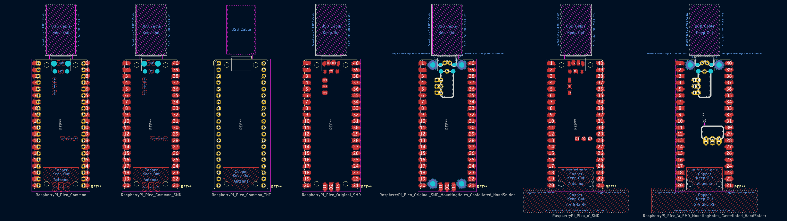
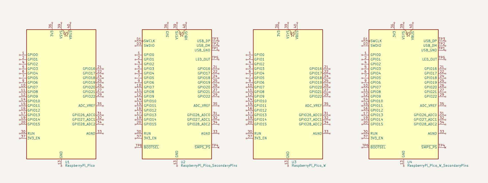
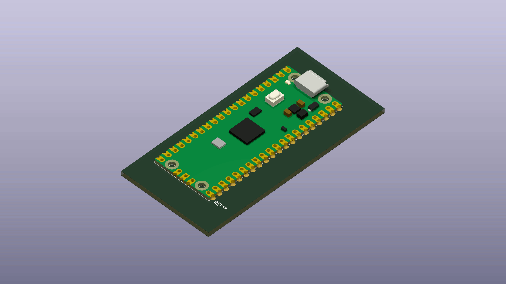

**Source of the comprehensive KiCad Library for the Raspberry Pi Pico** 🥧
==========================================================================

### Providing footprints, symbols, & models for the module's various forms & implementations

> *For the git submodule, see [Ki-Lime Pi To-Go][URL-Submodule]*

[][URL-Repository]

  
*Some of the offered footprints of the Raspberry Pi Pico; additional more specific footprints also included.*

  
*Some of the offered schematic symbols of the Raspberry Pi Pico; many pins provide alternate pin definitions.*

  
*The models feature the original Pico, Pico H, Pico W, and Pico WH; they are able to be visualised in surface-mount, through-hole, and socketed forms.*

&nbsp;

***Features***
==============

- **KiCad 8.0 support** *(For KiCad 7.0 support, see [release 1.1.0][URL-Release-7.0-Support])*
- **Schematics with alternate pin definitions** to select more specific behaviours for each GPIO, as well as specify power directionality
- **Generic and specific footprints** for the Pico and Pico W
  - Through-hole and surface-mount footprints with and without mounting holes
  - Hand-solderable test points (ie. USB signals) in footprints with underside castellations
  - Optional pin labels as an add-on footprint
  - Optional keepout zone for 2.4 GHz RF on shared footprints
  - Ability to add individual schematic symbols for sockets, and a virtual Pico for the BOM and rendering
- **Diverse 3D models** for surface-mount, through-hole, and socketed forms of the Pico, Pico H, Pico W, and Pico WH using photorealistic materials
- Majority adherence to the [KiCad Library Conventions][URL-KLC] version 3.0.41

&nbsp;

***How do I use this library?***
================================

> *If you want to include this library as a git submodule, check out [Ki-Lime Pi To-Go][URL-Submodule]*

- Ensure you are running KiCad 8.0 or later *(For KiCad 7.0 support, see [release 1.1.0][URL-Release-7.0-Support])*
- Download the most recent [release][URL-Releases] of the library
- Unzip the file contents
- If not already created, create a new KiCad project
- Move the root library directory `RaspberryPi_Pico/` to a folder anywhere within your KiCad project
  > *If using the library globally, move `RaspberryPi_Pico/` to a globally accessible location*
- Open the relevant KiCad project
- Select `Preferences > Manage Footprint Libraries...`
- Select the `Project Specific Libraries` tab
  > *If using the library globally, select the `Global Librarires` tab instead*
- Click the folder icon in the lower left to `Add Existing`
- Navigate to and select `.../RaspberryPi_Pico/Module_RaspberryPi_Pico.pretty/`
- Click `OK`
- Select `Preferences > Manage Symbol Libraries...`
- Select the `Project Specific Libraries` tab
  > *If using the library globally, select the `Global Libaries` tab instead*
- Click the folder icon in the lower left to `Add existing library to table`
- Navigate to and select `.../RaspberryPi_Pico/MCU_Module_RaspberryPi_Pico.kicad_sym`
- Click `OK`

To use, simply add a symbol to your schematic as you would any other; symbols should be located under the section `MCU_Module_RaspberryPi_Pico`, and footprints under `Module_RaspberryPi_Pico`.

### **You're all set to design exciting new circuit boards using the Raspberry Pi Pico! 🎉**

&nbsp;

***Further reading***
=====================

## Other KiCad implementations of the Raspberry Pi Pico:

*Some adjacent solutions I encountered during my research for this project*

- Official Raspberry Pi KiCad library files for the Pico and Pico W provided in [Hardware design with the RP2040, Section 3][URL-Official-Example]
    - <https://datasheets.raspberrypi.com/rp2040/VGA-KiCAD.zip>
    - <https://datasheets.raspberrypi.com/rp2040/VGA-PicoW-KiCAD.zip>
- A detailed SketchUp model of the surface-mount Pico incorporating the above Pico library
  - <https://github.com/ncarandini/KiCad-RP-Pico>
- A similarly versatile library found on the [KiCad forums][URL-KiCad-Forums-mgyger] for all the Pico variants, including a castellated *add-on board* footprint
  - <https://gitlab.com/mgyger/kicad-symbols/-/blob/pico/MCU_Module.kicad_sym>
  - <https://gitlab.com/mgyger/kicad-footprints/-/tree/pico/Module.pretty>

## Pico W antenna radiation pattern resources:

- Great teardown featured:
  - <https://electronupdate.blogspot.com/2022/07/raspberry-pi-pico-w-silicon-level.html>
    - <https://youtu.be/dWJE1ALMlBw>
- Antenna info:
  - <https://www.antenna-theory.com/design/raspberry-pi-antenna.php>
    - <https://youtu.be/MQ8gCsPoo6k>
  - <https://www.tablix.org/~avian/blog/archives/2022/03/effect_of_ground_cutout_on_the_cm4_antenna/>
- Possible antenna radiation pattern:
  - <https://abracon.com/parametric/antennas/PRO-EB-592>
    - <https://abracon.com/datasheets/PRO-EB-592.pdf>
  - <https://abracon.com/parametric/antennas/PRO-EB-594>
    - <https://abracon.com/datasheets/PRO-EB-594.pdf>
  - <https://embeddedcomputing.com/technology/analog-and-power/power-semiconductors-wireless-charging/a-lesson-in-wireless-engineering-from-the-raspberry-pi>
  - <https://antennatestlab.com/antenna-examples/raspberry-pi-model-3b-antenna-evaluation-gain-pattern>

## Additional further reading:

- A similar example of implementing 3 discrete components as one apparent symbol for a socketed device on the [KiCad forums][URL-KiCad-Forums-cdwilson]

&nbsp;

***License / Access***
======================

This work is made freely available under your choice of the [*MIT-0*](./LICENSE.txt) license or [*CC0-1.0*][URL-CC0].  
Although attribution is not required, sharing when you've made something with my work is really cool 💖

*No additional/conflicting permissions were present in this repository at the time of release.*

----------------------

*Repository: <https://gitlab.com/recursivenomad/ki-lime-pi-pico/>*  
*Releases: <https://gitlab.com/recursivenomad/ki-lime-pi-pico/-/releases/>*  
*Submodule: <https://github.com/recursivenomad/ki-lime-pi-to-go/>*  
*Contact: <recursivenomad@protonmail.com>*

----------------------

### Donations

 Online payment 

  > &nbsp;  
  > The following online payments are processed through Stripe:
  >
  > [][URL-Liberapay-Donate]
  > ~ *Gifts recurring unconditional donations and reduces fees (via Liberapay)*
  >
  > [][URL-Donate]
  > ~ *Gifts an unconditional donation*
  >
  > [][URL-Sponsor]
  > ~ *Sends a donation specifically to support open-source development*
  >
  > [][URL-Pledge]
  > ~ *Sets up a recurring donation to support open-source development*  
  > &nbsp;

 Monero (XMR) 

  > *Unconditional donations*  
  > [`monero:`][URI-Monero-Donate]`8Bhyeo232EVDiK7aRSzHGRC28RZ1H6FL55V6CVyCVtxdDRQXHk8btPU8Wr5G8K3AWgaK19JfYbshKfHWqc177jwtCtCSaz1`
  >
  > *Donations specifically to support open-source development*  
  > [`monero:`][URI-Monero-Sponsor]`84FR721bYUHGY2SHWWBe5hHSmJqp11dX32j6wM6h8oWL3UczEMqC2X58StfNG8JC3NKSWas1W17YL3qPCJSsPuVh2eMGctS`

 Ether (ETH) 

  > *Unconditional donations*  
  > [`ethereum:`][URI-Ether-Donate]`0xD1b824f2Ec3D609e816B04A301124129602A5238`
  >
  > *Donations specifically to support open-source development*  
  > [`ethereum:`][URI-Ether-Sponsor]`0x3DFbbc82329c74846fe2ce3bfE4BCB660A1968f2`

 Bitcoin (BTC) 

  > *Unconditional donations*  
  > [`bitcoin:`][URI-Bitcoin-Donate]`bc1qadq5kyuuc7etgu5ywlygnaepqhzgc2u7gxkze2`
  >
  > *Donations specifically to support open-source development*  
  > [`bitcoin:`][URI-Bitcoin-Sponsor]`bc1q2pffcm4xxkp59mz5y0ea52lw5gk408dfglsgns`

[URL-Liberapay-Donate]: <https://liberapay.com/recursivenomad/donate>
"Gift recurring unconditional donations with reduced fees
(Stripe via Liberapay)"

[URL-Donate]: <https://donate.stripe.com/dR6dSU1PueevgKY4gs>
"Gift an unconditional donation
(via Stripe)"

[URL-Sponsor]: <https://donate.stripe.com/4gw9CE9hW8UbeCQcN2>
"Send a donation to support open-source development
(via Stripe)"

[URL-Pledge]: <https://buy.stripe.com/dR64ikgKofizeCQeVe>
"Set up a recurring donation to support open-source development
(via Stripe)"

[URI-Monero-Donate]: <monero:8Bhyeo232EVDiK7aRSzHGRC28RZ1H6FL55V6CVyCVtxdDRQXHk8btPU8Wr5G8K3AWgaK19JfYbshKfHWqc177jwtCtCSaz1?recipient_name=recursivenomad&tx_description=Donation> "Donate with Monero"
[URI-Monero-Sponsor]: <monero:84FR721bYUHGY2SHWWBe5hHSmJqp11dX32j6wM6h8oWL3UczEMqC2X58StfNG8JC3NKSWas1W17YL3qPCJSsPuVh2eMGctS?recipient_name=recursivenomad&tx_description=Sponsoring%20open-source%20development> "Sponsor with Monero"
[URI-Ether-Donate]: <ethereum:0xD1b824f2Ec3D609e816B04A301124129602A5238> "Donate with Ether"
[URI-Ether-Sponsor]: <ethereum:0x3DFbbc82329c74846fe2ce3bfE4BCB660A1968f2> "Sponsor with Ether"
[URI-Bitcoin-Donate]: <bitcoin:bc1qadq5kyuuc7etgu5ywlygnaepqhzgc2u7gxkze2?label=recursivenomad&message=Donation> "Donate with Bitcoin"
[URI-Bitcoin-Sponsor]: <bitcoin:bc1q2pffcm4xxkp59mz5y0ea52lw5gk408dfglsgns?label=recursivenomad&message=Sponsoring%20open-source%20development> "Sponsor with Bitcoin"

[URL-MIT-0]: <https://opensource.org/license/mit-0/>
[URL-CC0]: <https://creativecommons.org/publicdomain/zero/1.0/>

[URL-Repository]: <https://gitlab.com/recursivenomad/ki-lime-pi-pico/>
[URL-Releases]: <https://gitlab.com/recursivenomad/ki-lime-pi-pico/-/releases/>
[URL-Release-7.0-Support]: <https://gitlab.com/recursivenomad/ki-lime-pi-pico/-/releases/1.1.0>
[URL-Submodule]: <https://github.com/recursivenomad/ki-lime-pi-to-go>

[URL-KiCad-Forums-cdwilson]: <https://forum.kicad.info/t/21104>
[URL-KiCad-Forums-mgyger]: <https://forum.kicad.info/t/35844/12>
[URL-KLC]: <https://klc.kicad.org/>
[URL-Official-Example]: <https://datasheets.raspberrypi.com/rp2040/hardware-design-with-rp2040.pdf#page=15>
